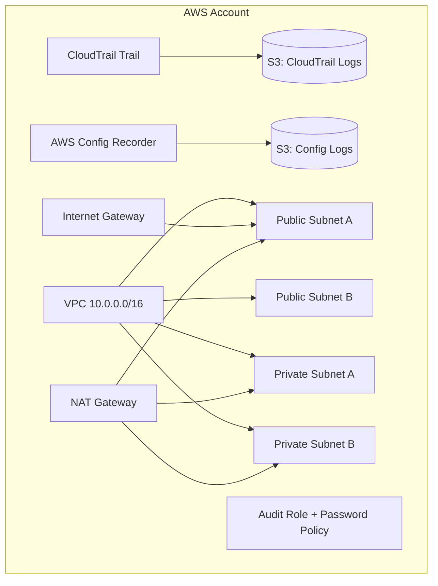

# AWS Secure Baseline (Terraform)

> Secure-by-default AWS account baseline in Terraform — logging, network segmentation, IAM hygiene, and config tracking, wired up as reusable modules.

[](https://github.com/abedabadoo/aws-secure-baseline-terraform/actions/workflows/iac-security.yml)

## What this is

A modular Terraform baseline that brings a fresh AWS account up to a defensible security floor: multi-region CloudTrail, encrypted log buckets, AWS Config, a segmented VPC, and an IAM password policy + audit role. Every module is independently usable and CI-scanned with Checkov and tfsec on every push.

## See it in action

The portfolio piece is the **[sample baseline audit report](docs/sample-baseline-audit-report.md)** — a real-world style write-up of findings, severities, recommendations, and a remediation roadmap produced against this baseline. Start there if you want the GRC-flavored view of what this repo delivers.

---

## Modules

- **modules/logging**
  - CloudTrail multi-region trail
  - Encrypted S3 log bucket + required bucket policy
- **modules/vpc**
  - VPC with 2 public + 2 private subnets
  - IGW, NAT Gateway, route tables and associations
- **modules/config**
  - AWS Config recorder + delivery channel
  - Encrypted S3 bucket for config snapshots/history + required bucket policy
- **modules/iam_baseline**
  - Account password policy
  - Read-only audit role (MFA required by default)
- **modules/securityhub** *(optional / currently disabled)*
  - Left in repo but disabled if running Terraform with root credentials

> Environment shown: **dev** &middot; AWS Region: **us-east-1** &middot; State: **S3 backend** (`abu-secure-baseline-tfstate-2025`) with **S3-native locking**

---

## Architecture (high-level)



---

## Security scanning

Every push and pull request runs the **[IaC Security workflow](.github/workflows/iac-security.yml)**:

- `terraform fmt -check -recursive` — fails the build on drift
- `terraform init -backend=false` + `terraform validate` against `environments/dev`
- **[Checkov](https://www.checkov.io/)** — full repo scan, SARIF uploaded to the GitHub Security tab
- **[tfsec](https://aquasecurity.github.io/tfsec/)** — full repo scan, SARIF uploaded to the GitHub Security tab

Scanners run in **soft-fail** mode: the value here is *surfacing* findings continuously (and watching the trend line over time), not gatekeeping the main branch on every rule. Results are visible in two places:

- [Actions tab](https://github.com/abedabadoo/aws-secure-baseline-terraform/actions) — run history and logs
- [Security tab → Code scanning](https://github.com/abedabadoo/aws-secure-baseline-terraform/security/code-scanning) — deduplicated findings with severity, file, and line

Run the same scan locally with `make security` (requires `brew install tfsec`).

---

## Quickstart

```bash
# 1. Configure AWS credentials (env vars, profile, or SSO)
cp environments/dev/terraform.tfvars.example environments/dev/terraform.tfvars

# 2. Drive it through the Makefile
make init
make plan
make apply
```

Tear down with `make destroy`. Format with `make fmt`. Validate with `make validate`.

---

## License

[MIT](LICENSE) &copy; 2025 Abu Al-Najjar
